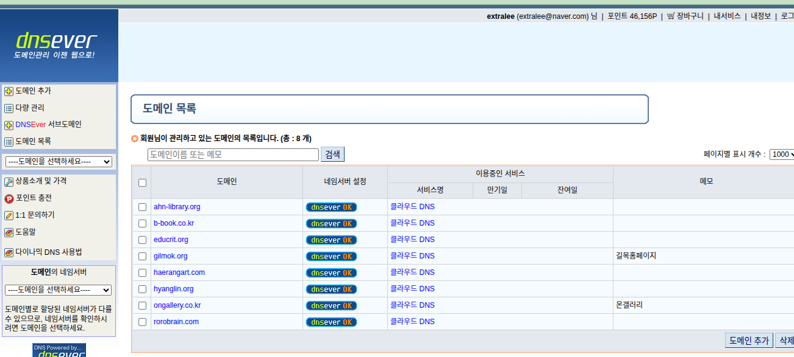

# DNS 관리 현황

## DNSEver 계정 관리 도메인 목록

> **계정**: extralee (extralee@naver.com)  
> **관리 도메인 수**: 총 8개  
> **캡처일**: 2026-09-12

## 도메인별 현황

| 도메인 | 네임서버 | DNS 서비스 | 메모 | KT→가비아 이관 |
|---|---|---|---|---|
| `ahn-library.org` | dnsever OK | 클라우드 DNS | — | → #54 |
| `b-book.co.kr` | dnsever OK | 클라우드 DNS | 도서출판b | 가비아 세팅 완료 (DNS 전환 대기) ⏳ (#66) |
| `educrit.org` | dnsever OK | 클라우드 DNS | — | 이관 완료 ✅ (#60) |
| `gilmok.org` | dnsever OK | 클라우드 DNS | 길목홈페이지 | 이관 완료 ✅ (#61) |
| `haerangart.com` | dnsever OK | 클라우드 DNS | — | 이관 완료 ✅ (#59) |
| `hyanglin.org` | dnsever OK | 클라우드 DNS | — | 이관 완료 ✅ |
| `ongallery.co.kr` | dnsever OK | 클라우드 DNS | 온갤러리 | 이관 완료 ✅ (#26) |
| `rorobrain.com` | dnsever OK | 클라우드 DNS | 로로브레인 | 이관 완료 ✅ (#26) |

## 핵심 발견사항

- **DNSEver 관리 도메인**: ahn-library, b-book, educrit, gilmok, haerangart, hyanglin, ongallery, rorobrain → **모두 DNS A 레코드 변경 권한 있음** ✅
- **DNSEver 미등록 도메인** (별도 관리 필요):
  - `parkhyungkyu.org` → 가비아 네임서버 (`ns.gabia.co.kr`) 관리
  - `simwon.org` → 가비아 네임서버 (`ns.gabia.co.kr`) 관리 (이관 완료 ✅ #62)
  - `kscf.kr` → NXDOMAIN (아카이브 완료 ✅)
  - `jaemisama.org` → DNSever (clientHold 상태, 아카이브 완료 ✅)
  - `cnblaw.kr` → NXDOMAIN/만료 (아카이브 완료 ✅ #65)

## DNS 변경 절차 (DNSEver)

1. [DNSEver 로그인](https://www.dnsever.com) (extralee@naver.com)
2. 도메인 목록에서 대상 도메인 클릭
3. A 레코드 편집: `14.63.198.35` → `45.115.154.229`
4. 저장 후 TTL 전파 대기 (보통 1시간 이내)

## 관련 이슈

- [#23 KT 레거시 서버 완전 폐기](https://github.com/wonhyukc/hyanglin-legacy/issues/23)
- [#26 기타 9개 사이트 가비아 이관](https://github.com/wonhyukc/hyanglin-legacy/issues/26)
