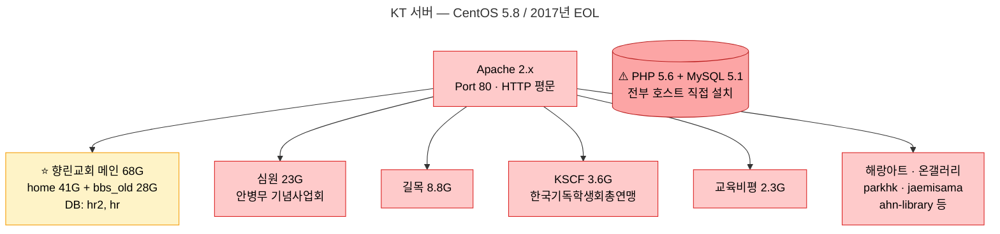
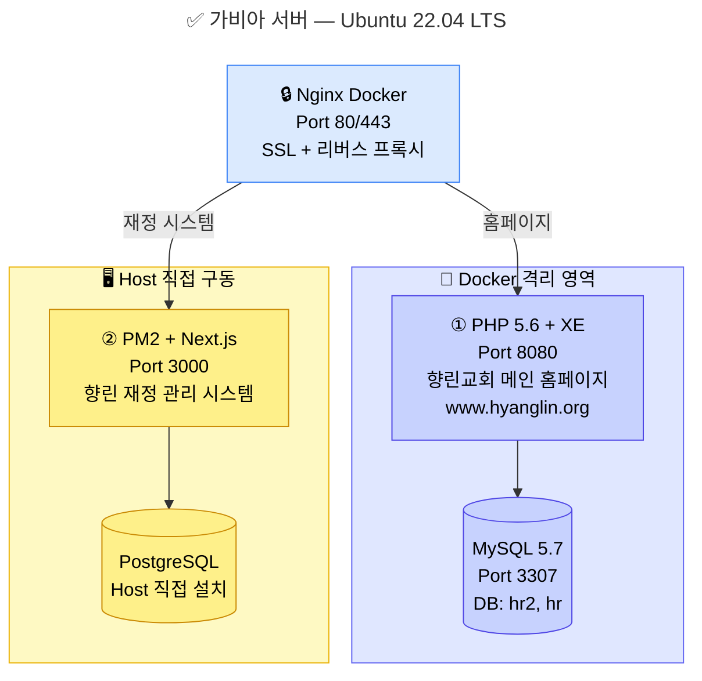
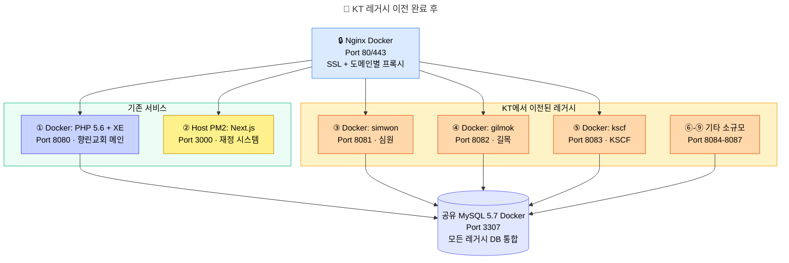
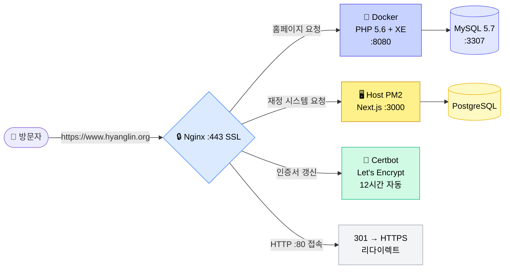

# 🔄 레거시 개발 패턴 vs 현대 웹 아키텍처 — 무엇이, 왜 달라졌나?

이 문서는 **XE(XpressEngine) / PHP 5.6 환경에 익숙한 개발자**가 현대적인 웹 개발 방식으로 전환할 때 꼭 알아야 할 핵심 차이점과 그렇게 바뀐 이유를 설명합니다.

> **대상 독자**: XE 모듈/위젯 개발이나 PHP 기반 홈페이지 유지보수를 해본 경험이 있지만, Docker, Nginx 프록시, React/Next.js, Git 등 현대 기술 스택에 아직 익숙하지 않은 분.

---

## 📋 목차
1. [전체 구조 비교 (한눈에 보기)](#1-전체-구조-비교-한눈에-보기)
   - 1-1. [향린 전산(재정 시스템)은 왜 Docker가 아닌가?](#1-1-향린-전산재정-시스템은-왜-docker가-아닌가)
2. [서버 환경: 호스트 직접 설치 → Docker 컨테이너](#2-서버-환경-호스트-직접-설치--docker-컨테이너)
3. [웹 서버: Apache → Nginx 리버스 프록시](#3-웹-서버-apache--nginx-리버스-프록시)
4. [보안: HTTP 평문 → HTTPS 필수 + 자동 갱신](#4-보안-http-평문--https-필수--자동-갱신)
5. [코드 구조: 스파게티 PHP → 컴포넌트 기반 프론트엔드](#5-코드-구조-스파게티-php--컴포넌트-기반-프론트엔드)
6. [데이터베이스: 직접 쿼리 → ORM / 타입 안전](#6-데이터베이스-직접-쿼리--orm--타입-안전)
7. [배포: FTP 수동 업로드 → Git + 자동화 배포](#7-배포-ftp-수동-업로드--git--자동화-배포)
8. [보안 방어 전략의 변화](#8-보안-방어-전략의-변화)
9. [왜 이렇게 바꿔야 하는가? — 5가지 핵심 이유](#9-왜-이렇게-바꿔야-하는가--5가지-핵심-이유)
10. [정리 — 레거시 개발자를 위한 학습 로드맵](#10-정리--레거시-개발자를-위한-학습-로드맵)

---

## 1. 전체 구조 비교 (한눈에 보기)

### 🏚️ 과거 — KT 서버 (14.63.198.35)



> ⚠️ 10개 이상의 사이트가 한 서버에 뒤섞여 구동 **(모놀리스)**. 모든 사이트가 같은 PHP, 같은 MySQL, 같은 OS를 공유 → **하나가 해킹당하면 전체가 위험**

### ✅ 현재 — 가비아 프로덕션 서버 (45.115.154.229)



### 1-1. 향린 전산(재정 시스템)은 왜 Docker가 아닌가?

위 다이어그램에서 ②번 재정 관리 시스템만 Docker가 아닌 **Host PM2 직접 구동**인 이유, 그리고 이 구조의 리스크와 향후 방향을 정리합니다.

#### 🤔 Docker를 쓰지 않은 이유

Docker 격리를 도입한 **1차 이유는 보안**이었습니다. 서비스마다 Docker가 필요한 정도가 다릅니다:

| 서비스 | Docker 격리 필요성 | 이유 |
| :--- | :--- | :--- |
| **레거시 홈페이지 (PHP 5.6 + XE)** | ⭐ **필수** | PHP 5.6은 **EOL(단종)** — Ubuntu 22에 설치 자체가 불가능하고, 알려진 보안 취약점이 수백 개. Docker 샌드박스 없이 호스트에 노출하면 서버 전체가 위험 |
| **재정 시스템 (Next.js + Node.js)** | 선택적 | 최신 Node.js 런타임 — Ubuntu 22와 완벽 호환, 보안 패치 정상 지원 중. 호스트에서 직접 실행해도 보안 위험 없음 |

또한 **개발 단계에서의 편의성**도 이유입니다. 활발히 코드를 수정하고 디버깅하는 단계에서 Host 직접 구동은 Docker보다 반복 개발 속도가 빠릅니다.

#### ⚠️ 하지만 — 현재 구조의 잠재적 리스크

"Docker가 아니면 전체 시스템에 문제를 일으킬 수 있지 않느냐?"는 **타당한 우려**입니다:

| 리스크 | 설명 |
| :--- | :--- |
| **메모리 누수** | Next.js 앱에 메모리 누수가 발생하면 호스트 OS의 RAM을 잠식 → Nginx, MySQL Docker 컨테이너까지 영향 |
| **CPU 폭주** | 무한 루프 등으로 CPU를 100% 점유하면 같은 호스트의 다른 서비스 성능 저하 |
| **좀비 프로세스** | PM2가 비정상 종료를 처리하지 못하면 포트 점유 상태로 잔류 |
| **Node.js 버전 충돌** | 향후 호스트에 다른 Node.js 앱을 추가할 때 버전 요구사항이 충돌할 가능성 |

#### 🛡️ 현재 PM2가 제공하는 최소한의 보호 수단

PM2는 완전한 격리는 아니지만, 최소한의 안전장치는 있습니다:

```bash
# PM2의 자동 재시작 — 크래시 시 즉시 복구
pm2 start server.js --max-memory-restart 512M  # 512MB 초과 시 자동 재시작
```

- **자동 재시작**: 프로세스가 죽으면 PM2가 즉시 재시작
- **메모리 제한**: `--max-memory-restart` 옵션으로 메모리 상한 설정 가능
- **로그 관리**: 에러 로그 자동 수집

하지만 이것은 **"죽으면 살려준다"** 수준이지, Docker처럼 **"처음부터 벽을 세워서 영향을 차단한다"**는 것과 근본적으로 다릅니다.

#### 🎯 이상적인 향후 방향 — 재정 시스템도 Docker화

실제로 Docker화를 위한 **인프라는 이미 준비되어 있습니다**:
- [Dockerfile](../Dockerfile)이 이미 Next.js용으로 작성되어 있음
- [docker-compose.yml](../docker-compose.yml)에서 `web` 서비스가 **주석 처리된 상태**로 대기 중

```yaml
# docker-compose.yml — 현재 주석 처리된 상태
#  web:
#    build: .
#    restart: unless-stopped
#    environment:
#      - NODE_ENV=production
```

Docker화하면 달라지는 점:

| 항목 | Host PM2 (현재) | Docker (이상) |
| :--- | :--- | :--- |
| **메모리 격리** | ❌ 호스트 RAM 공유 | ✅ `deploy.resources.limits.memory: 512M` |
| **CPU 격리** | ❌ 호스트 CPU 공유 | ✅ `deploy.resources.limits.cpus: '1.0'` |
| **네트워크 격리** | ❌ 호스트 네트워크 직접 사용 | ✅ Docker 내부 네트워크만 사용 |
| **환경 재현성** | ⚠️ 호스트 OS 상태에 의존 | ✅ 어디서든 동일 환경 보장 |
| **배포 방식** | `git pull && pm2 restart` | `docker compose up --build -d` |

> 💡 **결론**: 현재 구조는 "틀린 것"이 아니라 **개발 편의를 우선한 선택**입니다. 서비스가 안정기에 접어들면 Docker 컨테이너로 전환하여 **완전한 격리**를 확보하는 것이 바람직합니다. Dockerfile과 docker-compose 설정이 이미 준비되어 있으므로 전환 비용도 크지 않습니다.
>
> 💡 **비유**: PM2 직접 구동은 "같은 집 안에서 방문만 닫아둔 것"이고, Docker 격리는 "아예 벽과 자물쇠가 있는 별도 호실을 쓰는 것"입니다. 방문만 닫아둔 상태에서도 대부분은 문제없지만, 한쪽 방에서 불(메모리 폭주)이 나면 같은 집 전체가 연기(자원 고갈)에 시달릴 수 있습니다.

### 🔮 향후 — KT 서버 레거시 사이트 이전 시 예상 구조

KT 서버에 남아있는 다른 레거시 사이트(심원, 길목, KSCF 등)가 가비아로 이전될 경우, 다음과 같이 **사이트별 독립 Docker 컨테이너**로 격리하는 것이 권장됩니다:



#### 💡 KT 레거시 이전 시 핵심 원칙

| 원칙 | 설명 |
| :--- | :--- |
| **사이트별 Docker 격리** | 각 사이트를 별도 Docker 컨테이너로 분리하여, 하나가 해킹당해도 다른 사이트에 피해 전파 차단 |
| **DB 통합 vs 분리 선택** | 소규모 사이트들은 MySQL 5.7 컨테이너 하나를 공유하되 DB 계정/권한을 분리. 대규모(심원 23G)는 별도 DB 컨테이너 고려 |
| **도메인별 Nginx 라우팅** | `simwon.org → Port 8081`, `gilmok.org → Port 8082` 등 Nginx `server_name`으로 사이트별 라우팅 |
| **읽기 전용 아카이브화 검토** | 활발히 운영되지 않는 사이트는 정적 HTML 스냅샷으로 변환하여 자원 절감 가능 |
| **포트 충돌 방지** | 각 레거시 컨테이너에 고유 포트 부여 (8081, 8082, ...) — **절대로 3000(재정) 또는 8080(메인 홈페이지)과 겹치지 않도록 주의** |

> 💡 **비유**: 과거 KT 서버는 원룸 하나에 10명이 함께 살던 구조였습니다. 가비아 이전 후에는 같은 아파트 건물(서버) 안에서 각자 개별 호실(Docker 컨테이너)을 쓰는 구조로 바뀝니다. 한 집에서 불이 나도 옆집에는 영향이 없습니다.

---

## 2. 서버 환경: 호스트 직접 설치 → Docker 컨테이너

### 🏚️ 과거 방식 (호스트 직접 설치)

```bash
# CentOS에 PHP를 직접 설치
yum install php php-mysql php-gd
# Apache를 직접 설치
yum install httpd
# MySQL을 직접 설치
yum install mysql-server

service httpd start
service mysqld start
```

**문제점:**
- 한 서버에 프로그램을 직접 설치하므로, **PHP 버전 업그레이드 시 다른 사이트가 동시에 깨질 수 있습니다.**
- OS 보안 패치가 끊기면(EOL) 서버 전체가 취약 상태에 빠집니다.
- "내 컴퓨터에서는 됐는데?" — 환경 차이로 인한 장애가 빈번합니다.

### 🐳 현재 방식 (Docker 컨테이너 격리)

```yaml
# docker-compose.yml — 한 파일로 전체 환경을 정의
services:
  legacy-mysql:
    image: mysql:5.7
    ports:
      - "3307:3306"

  nginx:
    image: nginx:alpine
    ports:
      - "80:80"
      - "443:443"
```

**장점:**
- 각 서비스가 **독립된 상자(컨테이너)** 안에서 실행되어, 하나가 문제가 생겨도 다른 서비스에 영향 없음.
- `docker compose up` 한 줄이면 누구의 컴퓨터에서든 완벽히 동일한 환경이 즉시 구동됨.
- 레거시 PHP 5.6이 필요하면 PHP 5.6 컨테이너만 따로 만들면 됨 (호스트 OS는 최신 유지).

> 💡 **비유**: 예전에는 온 식구가 한 방에 살았다면(모놀리스), 지금은 아파트처럼 각자 독립된 호실을 쓰면서도 같은 건물의 편의시설(네트워크)을 공유하는 구조입니다.

---

## 3. 웹 서버: Apache → Nginx 리버스 프록시

### 🏚️ 과거 방식 (Apache — 하나가 다 처리)

```apache
# httpd.conf — Apache가 PHP 해석 + 정적 파일 서빙 + SSL 전부 담당
<VirtualHost *:80>
    DocumentRoot /home/hr/www
    ServerName hyanglin.org
</VirtualHost>
```

- Apache가 PHP 해석, 이미지 서빙, 인증서 관리를 모두 담당 (만능 일꾼).
- `.htaccess` 파일 하나로 디렉터리별 설정을 덮어쓰는 분산 관리 → 어디서 어떤 규칙이 적용되는지 추적하기 어려움.
- 프로세스/스레드 기반으로 동시 접속 처리 → 대량 접속 시 메모리 사용량 폭증.

### ✅ 현재 방식 (Nginx — 전문 역할 분리)

```nginx
# nginx/conf.d/default.conf — Nginx는 문지기 역할만!
server {
    listen 443 ssl;
    server_name www.hyanglin.org;

    # 메인 홈페이지 → Docker PHP 컨테이너로 전달
    location / {
        proxy_pass http://host.docker.internal:8080;
    }
}
```

- Nginx는 **리버스 프록시(안내원)** 역할에 집중: 요청을 받아 올바른 서비스로 전달.
- SSL(HTTPS) 처리를 Nginx 한 곳에서 통합 관리.
- 이벤트 기반(비동기) 처리로 적은 메모리로도 대량 동시 접속 처리 가능.

#### Nginx 요청 흐름도



> 💡 **비유**: 예전 Apache는 안내도 하고, 요리도 하고, 청소도 하는 1인 만능 직원이었습니다. Nginx는 "나는 안내만 할게. 요리(PHP)는 셰프에게, 청소(SSL 갱신)는 청소팀(Certbot)에게" 하고 역할을 나눕니다.

---

## 4. 보안: HTTP 평문 → HTTPS 필수 + 자동 갱신

### 🏚️ 과거 방식

```
http://www.hyanglin.org   (포트 80, 암호화 없음)
```
- 로그인 비밀번호, 쿠키, 게시글 내용이 **평문(Plain Text)**으로 네트워크에 흘러다님.
- 누구든 같은 네트워크에서 데이터를 엿볼 수 있음(패킷 스니핑).
- SSL 인증서 설치가 번거롭고 비용이 발생하여 미적용하는 경우가 많았음.

### ✅ 현재 방식

```
https://www.hyanglin.org  (포트 443, TLS 1.3 암호화)
```
- 모든 데이터가 **암호화**되어 전송. 중간에서 엿봐도 해독 불가.
- Let's Encrypt 무료 인증서 + Certbot이 **12시간마다 자동 갱신** → 관리자가 신경 쓸 것 없음.
- 브라우저 주소창에 자물쇠 아이콘 표시 → 교인분들이 "안전한 사이트"임을 직관적으로 확인.

```yaml
# docker-compose.yml — Certbot이 자동으로 인증서 갱신
certbot:
  image: certbot/certbot
  entrypoint: "/bin/sh -c 'trap exit TERM; while :; do certbot renew; sleep 12h & wait $${!}; done;'"
```

> 💡 **비유**: 과거에는 엽서(HTTP)를 보냈습니다 — 배달부든 누구든 내용을 읽을 수 있습니다. 지금은 밀봉된 등기우편(HTTPS)을 보냅니다 — 수신자만 열어볼 수 있습니다.

---

## 5. 코드 구조: 스파게티 PHP → 컴포넌트 기반 프론트엔드

### 🏚️ 과거 방식 (PHP + HTML 혼합 — 스파게티 코드)

XE 게시판의 전형적인 PHP 파일 구조:

```php
<?php
// board.php — DB 조회, 비즈니스 로직, HTML이 한 파일에 다 섞여있음!
$db = mysql_connect('localhost', 'root', 'password');
mysql_select_db('hr2');
$result = mysql_query("SELECT * FROM xe_documents WHERE module_srl=123");
?>
<html>
<body>
  <h1>게시판</h1>
  <?php while($row = mysql_fetch_array($result)) { ?>
    <div class="post">
      <h2><?php echo $row['title']; ?></h2>   <!-- XSS 취약! -->
      <p><?php echo $row['content']; ?></p>    <!-- XSS 취약! -->
    </div>
  <?php } ?>
</body>
</html>
```

**문제점:**
- **DB 접속 코드 + 비즈니스 로직 + HTML 디자인**이 한 파일에 뒤엉켜 있음.
- 파일이 100개면 DB 접속 코드도 100곳에 흩어져 있음 → 비밀번호 변경 시 100곳 수정.
- HTML 출력에 이스케이프 처리가 빠지기 쉬움 → XSS 취약점.
- "이 함수가 어디서 호출되는지" 파악이 극히 어려움.

### ✅ 현재 방식 (컴포넌트 기반 — React / Next.js)

```
프로젝트 구조:
src/
├── components/     # UI 부품 (버튼, 카드, 헤더)
│   ├── PostCard.tsx
│   └── Header.tsx
├── app/            # 페이지 라우팅 (URL 경로)
│   ├── page.tsx
│   └── posts/[id]/page.tsx
├── lib/            # DB 접속, API 호출 (비즈니스 로직)
│   └── db.ts
└── styles/         # CSS 디자인
    └── globals.css
```

```tsx
// components/PostCard.tsx — UI만 담당하는 독립 컴포넌트
export function PostCard({ title, content }: { title: string; content: string }) {
  return (
    <div className="post-card">
      <h2>{title}</h2>       {/* React는 자동으로 XSS 이스케이프! */}
      <p>{content}</p>
    </div>
  );
}
```

```typescript
// lib/db.ts — DB 접속은 이 한 곳에서만 관리
import { PrismaClient } from '@prisma/client';
const prisma = new PrismaClient();

export async function getPosts() {
  return prisma.document.findMany({
    orderBy: { created_at: 'desc' }
  });
  // SQL을 직접 쓰지 않으므로 SQL Injection 원천 차단!
}
```

**장점:**
- **관심사 분리(Separation of Concerns)**: UI는 `components/`, 로직은 `lib/`, 페이지는 `app/`에 깔끔하게 나뉨.
- **컴포넌트 재사용**: `<PostCard>` 부품을 게시판에서도, 메인 페이지에서도 동일하게 재활용.
- **자동 XSS 방어**: React/Next.js는 출력값을 자동으로 이스케이프 처리.
- **타입 안전성**: TypeScript가 "이 변수는 숫자인데 문자열을 넣었어!" 등의 실수를 코드 작성 시점에 즉시 경고.

> 💡 **비유**: 과거에는 요리(로직), 재료 준비(데이터), 테이블 세팅(디자인)을 한 사람이 한 도마에서 전부 했습니다. 지금은 주방장은 요리만, 서빙 담당은 세팅만, 구매 담당은 재료만 관리합니다. 일이 체계적으로 나뉘니 실수가 줄고 효율이 올라갑니다.

---

## 6. 데이터베이스: 직접 쿼리 → ORM / 타입 안전

### 🏚️ 과거 방식 (PHP에서 SQL 문자열 직접 작성)

```php
<?php
// 과거의 전형적인 DB 코드 (PHP 5.6 + mysql_* 함수)
$name = $_GET['name'];  // 사용자 입력값

// ❌ SQL Injection 취약!
$sql = "SELECT * FROM members WHERE name = '" . $name . "'";
$result = mysql_query($sql);

while ($row = mysql_fetch_array($result)) {
    echo $row['name'] . " — " . $row['email'];  // ❌ XSS 취약!
}
?>
```

**문제점:**
- SQL 쿼리를 **문자열 이어붙이기**로 작성 → SQL Injection에 무방비.
- 반환값의 타입을 보장하지 못함 (`$row['email']`이 문자열인지 null인지 알 수 없음).
- 테이블 구조가 바뀌면 코드 곳곳에서 장애 발생 — 어디가 영향 받는지 추적 불가.

### ✅ 현재 방식 (ORM — Prisma 등)

```typescript
// Prisma ORM — 스키마 정의 (schema.prisma)
model Member {
  id    Int    @id @default(autoincrement())
  name  String
  email String @unique
}
```

```typescript
// 코드에서 사용 — SQL을 직접 쓰지 않음
const members = await prisma.member.findMany({
  where: { name: userName }  // 자동으로 Prepared Statement 적용!
});

// 반환된 member는 TypeScript 타입이 정해져 있음
members.forEach(m => {
  console.log(m.name);   // ✅ 타입 자동 완성 + 오타 즉시 경고
  console.log(m.emial);  // ❌ 컴파일 에러! — "emial" 오타를 즉시 잡아줌
});
```

**장점:**
- SQL을 직접 쓰지 않으므로 **SQL Injection 위험이 원천 차단**.
- 스키마(데이터 구조)를 한 곳에서 정의하면 코드 전체에 자동 반영.
- IDE에서 자동 완성, 오타 검출, 리팩토링이 완벽 지원됨.

> 💡 **비유**: 과거에는 식당 주문서를 손글씨로 썼다면(SQL 직접 작성), 지금은 터치스크린 POS 단말기(ORM)를 사용합니다. POS가 메뉴에 없는 주문은 입력 자체를 막아주니까 주문 실수(SQL Injection)가 원천적으로 없어집니다.

---

## 7. 배포: FTP 수동 업로드 → Git + 자동화 배포

### 🏚️ 과거 방식 (FTP / SCP 수동 업로드)

```
개발자 PC → FileZilla(FTP) → 서버 /home/hr/www/ 에 파일 덮어쓰기
```

**문제점:**
- 잘못된 파일을 덮어쓰면 **되돌리기(Rollback)가 불가능** — 백업이 없으면 끝.
- 누가 언제 무엇을 수정했는지 **기록이 없음**.
- 두 사람이 같은 파일을 동시에 수정하면 한 쪽의 변경이 사라짐 (덮어쓰기 충돌).

### ✅ 현재 방식 (Git 버전 관리 + 자동화)

```bash
# 모든 변경을 추적하고 기록
git add .
git commit -m "게시판 XSS 보안 패치 적용"
git push origin main

# 잘못했으면 즉시 되돌리기
git revert HEAD     # 마지막 변경을 안전하게 취소
```

**장점:**
- 모든 수정 내역이 **줄 단위**로 기록됨 — "3개월 전에 누가 이 줄을 왜 바꿨는지" 추적 가능.
- 실수로 코드를 망쳐도 **1초 만에 이전 상태로 복원** 가능.
- 여러 명이 동시에 작업해도 Git이 **자동으로 변경사항 병합(Merge)**.

> 💡 **비유**: 과거에는 원본 문서를 직접 지우개로 지우고 다시 썼습니다(FTP 덮어쓰기). 지금은 구글 문서처럼 모든 수정 기록이 남고, 언제든 "이전 버전으로 되돌리기"가 가능합니다.

---

## 8. 보안 방어 전략의 변화

| 보안 위협 | 과거의 방어 (또는 무방비) | 현재의 방어 |
| :--- | :--- | :--- |
| **SQL Injection** | `mysql_query()`에 문자열 이어붙이기 → 무방비 | ORM (Prisma) 자동 파라미터 바인딩 |
| **XSS** | `echo $input;` 그대로 출력 → 무방비 | React 자동 이스케이프 + CSP 헤더 |
| **평문 통신** | HTTP(80) 평문 전송 | HTTPS(443) TLS 암호화 필수 |
| **서버 침투** | OS/PHP 보안패치 중단(EOL) | Docker 격리 + Ubuntu LTS 보안패치 |
| **배포 사고** | FTP 덮어쓰기 → 원복 불가 | Git 버전 관리 → 즉시 Rollback |
| **비밀번호 관리** | 소스코드에 DB 비밀번호 하드코딩 | 환경변수(`.env`) 또는 Secret Manager |

---

## 9. 왜 이렇게 바꿔야 하는가? — 5가지 핵심 이유

### 이유 1. 🔒 보안 — "구멍 난 집에 자물쇠만 달 수 없다"
CentOS 5.8과 PHP 5.6은 더 이상 보안 업데이트를 받지 못합니다. 알려진 취약점(CVE)이 수백 개 이상 공개되어 있지만, 패치가 존재하지 않습니다. Docker로 격리하지 않으면 한 게시판의 취약점이 서버 전체를 위험에 빠뜨릴 수 있습니다.

### 이유 2. 📱 모바일 대응 — "2026년에 PC만 지원해서는 안 된다"
XE 1.x 기본 스킨은 반응형(Responsive) 디자인을 지원하지 않습니다. 교인분들의 80% 이상이 스마트폰으로 홈페이지에 접속하는 시대에, 모바일 친화적인 UI/UX는 선택이 아닌 필수입니다. React/Next.js 기반 프론트엔드는 처음부터 모바일 반응형으로 설계됩니다.

### 이유 3. ⚡ 성능 — "3초 안에 안 뜨면 떠난다"
XE의 서버 사이드 렌더링은 매 페이지 요청마다 PHP가 DB 쿼리를 수행하고 HTML을 처음부터 조립합니다. Next.js는 **SSG(Static Site Generation)**와 **캐싱**을 통해 자주 바뀌지 않는 페이지를 미리 만들어 두므로 로딩 속도가 극적으로 빨라집니다.

### 이유 4. 🧑‍💻 유지보수성 — "고칠 수 있는 코드여야 고칠 수 있다"
PHP 스파게티 코드에서는 하나를 고치면 다른 데가 깨지는 부작용(사이드 이펙트)이 빈번합니다. 컴포넌트 기반 아키텍처에서는 각 부품이 독립적이므로 한 부품을 고쳐도 다른 부품에 영향이 거의 없습니다. TypeScript의 타입 검사가 수정 시 실수를 미리 잡아줍니다.

### 이유 5. 👥 협업 — "혼자 만들던 시대는 끝났다"
FTP 덮어쓰기 방식은 혼자 작업할 때도 위험하고, 여러 명이 작업하면 치명적입니다. Git 기반 워크플로우는 변경 내역 추적, 코드 리뷰, 브랜치(가지치기) 분리 작업을 지원하여 팀 단위 개발의 기본 인프라가 됩니다.

---

## 10. 정리 — 레거시 개발자를 위한 학습 로드맵

아래 순서대로 하나씩 익혀가시는 것을 추천합니다:

| 단계 | 주제 | 과거 대응물 | 핵심 학습 내용 |
| :--- | :--- | :--- | :--- |
| **1단계** | **Git 기초** | FTP 업로드 | `commit`, `push`, `pull`, `branch`, `revert` |
| **2단계** | **터미널 & SSH** | 호스팅 관리 패널 | 기본 리눅스 명령어, SSH 키 접속, `docker compose` |
| **3단계** | **Docker 기초** | 서버에 직접 설치 | `Dockerfile`, `docker-compose.yml`, 컨테이너 개념 |
| **4단계** | **HTML/CSS 현대화** | XE 스킨 편집 | Flexbox, CSS Grid, 반응형 미디어 쿼리 |
| **5단계** | **JavaScript 기초** | jQuery 스니펫 | ES6+ 문법, `const/let`, 화살표 함수, `async/await` |
| **6단계** | **React 기초** | PHP echo 출력 | 컴포넌트, `props`, `state`, JSX |
| **7단계** | **Next.js 입문** | XE 코어 | 파일 기반 라우팅, SSR/SSG, API Route |
| **8단계** | **TypeScript 입문** | 타입 없는 PHP | 타입 선언, 인터페이스, 컴파일 타임 에러 검출 |
| **9단계** | **ORM (Prisma)** | `mysql_query()` | 스키마 정의, 타입 안전 쿼리, 마이그레이션 |
| **10단계** | **웹 보안 기초** | 무방비 | [SQL Injection](./sql-injection-easy-guide.md), [XSS](./xss-easy-guide.md), HTTPS, CSP |

---

## 📌 관련 문서

- [SQL Injection 쉬운 가이드](./sql-injection-easy-guide.md) — 데이터베이스 공격 방어
- [XSS 쉬운 가이드](./xss-easy-guide.md) — 브라우저 스크립트 공격 방어
- [신규 서버 아키텍처 가이드](./new-server-architecture.md) — Docker / Nginx / SSL 상세 구조

> 💡 **한 줄 결론:** "과거 방식이 '나쁘다'는 것이 아니라, 세상이 변했기 때문에 도구와 방법도 함께 진화한 것입니다. 하나씩 차근차근 익혀가면 됩니다!"
