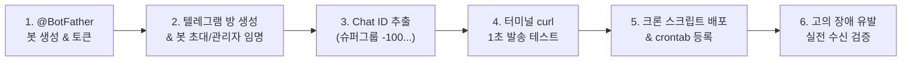

# 📱 텔레그램 실시간 장애 알림 완벽 구축 가이드 (Step-by-Step)

> **목적**: 새 서버나 신규 서비스 구축 시, 시행착오 없이 5분 만에 텔레그램 실시간 장애 알림을 완벽하게 세팅할 수 있는 실전 매뉴얼입니다.

---

## 📋 전체 구축 순서도



---

## [1단계] 텔레그램 봇 생성 및 API 토큰 발급 (1분)

1. 스마트폰이나 PC 텔레그램 검색창에 **`@BotFather`** 검색 후 대화 시작 (`/start`).
2. **`/newbot`** 입력.
3. 봇의 표시 이름(Name) 입력:
   - 예: `향린 서버 경보봇`
4. 봇의 고유 사용자명(Username) 입력 (`bot`으로 끝나야 함):
   - 예: `hyanglin_alert_bot`
5. 발급된 **HTTP API Token** 복사 및 보관:
   - 형태 예시: `8037347881:AAEXiAPgEC3iEzv-6MwNC0AN2ughbtZqm3E`

---

## [2단계] 알림 받을 단체방 생성 및 봇 초대 (1분)

1. 텔레그램에서 **새 그룹(New Group)** 또는 **새 채널(New Channel)** 생성.
   - 예: `향린교회 서버 모니터링`
2. 방금 1단계에서 만든 봇(예: `@hyanglin_alert_bot`)을 해당 방 멤버로 초대.
3. **[필수] 봇을 관리자(Administrator)로 임명**:
   - 방 설정 → 관리자(Administrators) → 관리자 추가 → 해당 봇 선택 → 메시지 게시(Post Messages) 권한 부여 후 저장.
4. 방 생성이 완료되면, 방 안에 아무 메시지나 1개 전송 (예: `테스트 시작`).
   *(봇이 방의 업데이트 이벤트를 읽을 수 있도록 하기 위함)*

---

## [3단계] ⚠️ 가장 중요한 함정: 정확한 Chat ID 추출하기 (1분)

> [!CAUTION]
> **자주 발생하는 실패 원인 1위 (슈퍼그룹 전환 문제)**:
> 텔레그램 그룹은 인원이 늘거나 설정이 바뀌면 일반 그룹(`-54...`)에서 **슈퍼그룹(`-100...`)**으로 자동 승격됩니다.
> 구형 ID를 쓰면 `Bad Request: group chat was upgraded to a supergroup chat` 에러가 나면서 알림이 전송되지 않습니다.
> 반드시 아래 절차로 **현재 유효한 Chat ID**를 확인하세요.

### Chat ID 확인 명령어
브라우저 주소창 또는 터미널에서 아래 명령을 실행합니다 (봇 토큰 대입):

```bash
curl -s "https://api.telegram.org/bot<본인의_봇_토큰>/getUpdates" | jq .
```

출력되는 JSON 결과에서 `"chat"` 블록을 확인합니다:

```json
"chat": {
  "id": -1004408048565,
  "title": "향린교회 서버 모니터링",
  "type": "supergroup"
}
```

- ✅ **정상 ID 형태**: `-100`으로 시작하는 음수 (예: `-1004408048565`)
- 만약 `"migrate_to_chat_id": -100...` 메시지가 보인다면, 그 화살표 뒤의 숫자가 진짜 새 ID입니다.

---

## [4단계] 터미널에서 1초 발송 테스트

터미널에서 아래 한 줄 명령을 실행하여 스마트폰 텔레그램으로 메시지가 꽂히는지 확인합니다:

```bash
BOT_TOKEN="8037347881:AAEXiAPgEC3iEzv-6MwNC0AN2ughbtZqm3E"
CHAT_ID="-1004408048565"

curl -s -X POST "https://api.telegram.org/bot${BOT_TOKEN}/sendMessage" \
  -d "chat_id=${CHAT_ID}" \
  -d "text=🔔 [테스트] 텔레그램 알림 연동이 성공했습니다!" \
  -d "parse_mode=Markdown"
```

- 스마트폰에 알림이 울리면 기본 통신망 구축이 완료된 것입니다.

---

## [5단계] 헬스체크 크론 스크립트 작성 및 배포

### 1. 스크립트 파일 생성
서버의 `/home/wonhyukc/scripts/health-check-cron.sh`에 아래 표준 템플릿을 저장합니다 (로컬 SSOT: `server-scripts/health-check-cron.sh`):

```bash
#!/usr/bin/env bash
# ─────────────────────────────────────────────
# 프로덕션 서버 자동 헬스체크 및 텔레그램 경보 스크립트
# ─────────────────────────────────────────────

# 1. 텔레그램 접속 정보
TELEGRAM_BOT_TOKEN="8037347881:AAEXiAPgEC3iEzv-6MwNC0AN2ughbtZqm3E"
TELEGRAM_CHAT_ID="-1004408048565"

# 2. 점검 대상 웹 서비스 목록 (이름|로컬포트|경로)
SITES=(
  "향린 메인|8080|/"
  "안병무도서관|8087|/"
  "이양노 갤러리|8081|/home/"
  "법무법인오늘|8091|/home/"
  "박형규 기념사업회|8082|/"
  "해랑|8083|/"
  "교육비평|8084|/"
  "길목|8085|/"
  "심원 아카이브|8086|/"
  "로로브레인|8088|/"
  "비북|8089|/"
  "시네마 버킷리스트|8090|/"
)

DISK_WARN=80
PASS=0; FAIL=0; WARN=0
FAIL_ITEMS=()
LOG="/data/log/health-check.log"

now() { date '+%Y-%m-%d %H:%M KST'; }

# 3. 웹 서비스 응답 코드 점검
for entry in "${SITES[@]}"; do
  IFS="|" read -r name port path <<< "$entry"
  code=$(curl -s -o /dev/null -w '%{http_code}' --max-time 10 "http://localhost:${port}${path}" 2>/dev/null || echo "000")
  if [[ "$code" == "200" || "$code" == "301" || "$code" == "302" ]]; then
    PASS=$((PASS+1))
  else
    FAIL=$((FAIL+1))
    FAIL_ITEMS+=("• ${name} (${port}): HTTP ${code}")
  fi
done

# 4. 호스트 PM2 서비스 점검 (향린 재정)
fin_code=$(curl -s -o /dev/null -w '%{http_code}' --max-time 10 "http://localhost:3000/" 2>/dev/null || echo "000")
if [[ "$fin_code" == "200" || "$fin_code" == "301" || "$fin_code" == "302" ]]; then
  PASS=$((PASS+1))
else
  FAIL=$((FAIL+1))
  FAIL_ITEMS+=("• 향린 재정 (3000): HTTP ${fin_code}")
fi

# 5. 디스크 사용량 점검 (루트 및 /data)
disk_pct=$(df / --output=pcent | tail -1 | tr -dc '0-9')
if [ "$disk_pct" -ge "$DISK_WARN" ] 2>/dev/null; then
  FAIL=$((FAIL+1))
  FAIL_ITEMS+=("• 루트 디스크: ${disk_pct}% (${DISK_WARN}% 초과)")
else
  PASS=$((PASS+1))
fi

data_pct=$(df /data --output=pcent 2>/dev/null | tail -1 | tr -dc '0-9')
if [[ -n "$data_pct" ]] && [ "$data_pct" -ge "$DISK_WARN" ] 2>/dev/null; then
  FAIL=$((FAIL+1))
  FAIL_ITEMS+=("• 데이터 디스크: ${data_pct}% (${DISK_WARN}% 초과)")
else
  PASS=$((PASS+1))
fi

# 6. Docker 구동 컨테이너 수 점검
container_count=$(sudo docker ps --format '{{.Names}}' 2>/dev/null | wc -l)
if [ "$container_count" -lt 13 ] 2>/dev/null; then
  WARN=$((WARN+1))
  FAIL_ITEMS+=("• Docker: ${container_count}/13개만 구동 중")
else
  PASS=$((PASS+1))
fi

# 7. 검증 통계 로그 기록
total=$((PASS + WARN + FAIL))
echo "[$(now)] PASS=${PASS} WARN=${WARN} FAIL=${FAIL} (총 ${total})" >> "$LOG"

# 8. 장애(FAIL) 감지 시에만 텔레그램 발송 (평소에는 침묵)
if [[ ${#FAIL_ITEMS[@]} -gt 0 ]]; then
  text="🚨 *[향린 프로덕션 서버 경보]*%0A"
  text+="📅 $(now)%0A"
  text+="⚠️ *장애 항목 감지 (${#FAIL_ITEMS[@]}건)*:%0A"
  for item in "${FAIL_ITEMS[@]}"; do
    text+="${item}%0A"
  done
  text+="%0A정상: ${PASS}개 / 경고: ${WARN}개 / 장애: ${FAIL}개"

  curl -s -X POST "https://api.telegram.org/bot${TELEGRAM_BOT_TOKEN}/sendMessage" \
    -d "chat_id=${TELEGRAM_CHAT_ID}" \
    -d "text=${text}" \
    -d "parse_mode=Markdown" >/dev/null 2>&1

  echo "[$(now)] 📢 텔레그램 경보 발송 완료" >> "$LOG"
fi
```

### 2. 실행 권한 부여
```bash
chmod +x /home/wonhyukc/scripts/health-check-cron.sh
```

---

## [6단계] 10분 주기 크론(Crontab) 등록

서버 터미널에서 `crontab -e` 명령으로 아래 라인을 등록합니다:

```bash
# 향린 프로덕션 통합 헬스체크 및 텔레그램 경보 (10분 주기)
*/10 * * * * /home/wonhyukc/scripts/health-check-cron.sh >> /data/log/health-check.log 2>&1
```

---

## [7단계] 실전 장애 재현 및 수신 검증

알림 시스템이 실제로 장애를 감지하는지 아래 절차로 검증합니다:

1. **테스트용 장애 유발 (재정 앱 일시 정지)**:
   ```bash
   pm2 stop hyanglin-finance
   ```
2. **수동 크론 1회 실행**:
   ```bash
   /home/wonhyukc/scripts/health-check-cron.sh
   ```
3. **텔레그램 스마트폰 수신 확인**:
   - `🚨 [향린 프로덕션 서버 경보] 향린 재정 (3000): HTTP 000` 메시지가 3초 내 도착하는지 확인.
4. **서비스 즉시 정상 복구**:
   ```bash
   pm2 restart hyanglin-finance
   ```
5. **로그 확인**:
   ```bash
   tail -n 5 /data/log/health-check.log
   ```

---

## 🚨 트러블슈팅 가이드 (자주 발생하는 5대 오류)

| 에러 코드 / 현상 | 원인 | 즉시 해결 방법 |
|---|---|---|
| `401 Unauthorized` | 봇 토큰 오타 또는 만료 | `@BotFather`에서 `/token`을 입력해 토큰 재발급 후 교체 |
| `400 Bad Request: chat not found` | 봇이 단체방에 아직 초대되지 않음 | 단체방에 봇을 멤버로 초대하고 방에 메시지 1개 작성 |
| `400 Bad Request: group chat was upgraded to a supergroup` | 그룹이 슈퍼그룹으로 승격되며 ID 변경 | `getUpdates` API를 호출하여 `-100...`으로 시작하는 새 ID로 교체 |
| 알림이 영영 안 옴 | 실패 항목이 없어 침묵 중인 정상 상태 | 평소에는 로그(`/data/log/health-check.log`)에만 찍히며, FAIL일 때만 발송됨 |
| 크론에서만 텔레그램 발송 실패 | 크론 환경변수에서 `curl` 경로 미인식 | 스크립트 상단에 `PATH=/usr/local/bin:/usr/bin:/bin` 추가 |
